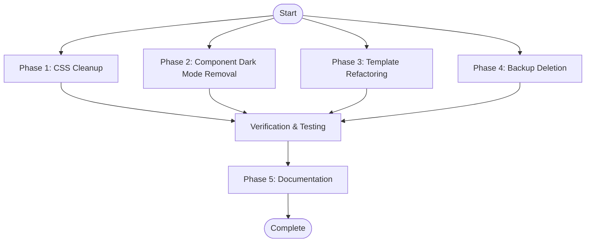

# WorldQuant Theme Cleanup & Harrison.ai Standardization Plan

> **Status**: ⚠️ INCOMPLETE - CODE REVIEW FAILED
> **Date**: 2025-12-30
> **Review Date**: 2025-12-30
> **Objective**: Remove ALL WorldQuant remnants, eliminate dark mode, and standardize on Harrison.ai white theme.
> **Completion**: ~75% (25% remediation required)
> **Blockers**: 4 critical issues prevent deployment

## Executive Summary
This plan orchestrates the complete removal of legacy "WorldQuant" branding (`.wq-*` classes, dark backgrounds) and the elimination of dark mode support (`@media (prefers-color-scheme: dark)`). The goal is a clean, maintainable, 100% white-themed Harrison.ai design system (`.aitsc-*`).

This is a **PARALLEL EXECUTION** plan. Phases 1, 2, 3, and 4 can largely run simultaneously, with Phase 5 (Documentation) and final verification running sequentially at the end.

## Dependency Graph

## Parallel Execution Tracks

### Track 1: CSS & Styling (Phase 1)
**Focus**: `style.css` global styles and variables.
- Remove legacy sections in `style.css`.
- Remove undefined variables (`--aitsc-bg-dark`).
- Remove global dark mode styles.

### Track 2: Components (Phase 2)
**Focus**: Individual component CSS files.
- Remove `@media (prefers-color-scheme: dark)` from all component CSS.
- Ensure all component classes use `.aitsc-*` prefix.

### Track 3: Templates (Phase 3)
**Focus**: PHP Template files (`.php`).
- Refactor `content-solutions.php`, `page.php`, `index.php`.
- Replace `.wq-*` classes with `.aitsc-*` equivalents.
- Use `aitsc_render_*` functions where applicable.

### Track 4: Cleanup (Phase 4)
**Focus**: File system hygiene.
- Delete backup files (`.dark-backup`, `assets_legacy_backup/`).
- Remove unused images/assets.

## Phase Details

### Phase 1: CSS Cleanup (`phase-01-css-cleanup.md`)
- **Target**: `wp-content/themes/aitsc-pro-theme/style.css`
- **Action**: Strip out lines 398, 776, 1589, 2100, 2270, 2301, 3523, 3728 (approximate).
- **Result**: Clean global stylesheet with only Harrison.ai variables.

### Phase 2: Component Dark Mode Removal (`phase-02-component-dark-mode-removal.md`)
- **Targets**: `card-variants.css`, `stats-styles.css`, `logo-carousel-styles.css`.
- **Action**: Remove media queries for dark mode.
- **Result**: Components that only render in white/light mode.

### Phase 3: Template Refactoring (`phase-03-template-refactoring.md`)
- **Targets**: `template-parts/content-solutions.php`, `page.php`, `index.php`.
- **Action**: Replace `wq-blog-card`, `wq-section-title` with `aitsc-card`, `aitsc-section-title`.
- **Result**: Templates fully decoupled from WorldQuant naming.

### Phase 4: Backup Deletion (`phase-04-backup-deletion.md`)
- **Targets**: `style.css.dark-backup`, `assets_legacy_backup/`, `components-dark-backup/`.
- **Action**: `rm -rf`.
- **Result**: Reduced repository size and confusion.

### Phase 5: Documentation (`phase-05-documentation.md`)
- **Targets**: `MIGRATION_GUIDE.md`, `components/PHASE3-COMPONENTS-GUIDE.md`.
- **Action**: Document the new state and class mappings.

## Estimated Timeline
- **Setup**: 15 mins
- **Parallel Execution**: 2-3 hours (if multiple agents utilized)
- **Testing**: 1 hour
- **Documentation**: 30 mins
- **Total**: ~4-5 hours

## Code Review Results (2025-12-30)

**Status**: ❌ **FAILED VERIFICATION**
**Report**: `plans/251230-1635-worldquant-cleanup/reports/code-reviewer-251230-cleanup-final.md`

### Critical Blockers (Must Fix)

1. **Undefined CSS Variables** (style.css:3547-3559)
   - `var(--wq-card-bg)` and `var(--wq-border)` undefined
   - Impact: Broken card styling
   - Fix: Replace with Harrison.ai variables

2. **Dark Mode Still Active** (2 files)
   - `template-parts/hero-mobile-optimized.php:660-669`
   - `template-parts/services-mobile-optimized.php:887-900`
   - Impact: Site switches to dark mode on dark-preferring devices
   - Fix: Delete all `@media (prefers-color-scheme: dark)` blocks

3. **WorldQuant Variables Intact**
   - `assets/css/variables.css` - entire WQ system still defined
   - Impact: WorldQuant branding NOT removed
   - Fix: Delete file or replace with Harrison.ai variables

4. **Multiple .wq- Class References**
   - Found in 5+ files (templates, style.css)
   - Impact: WorldQuant naming convention still in use
   - Fix: Search/replace all `.wq-*` with `.aitsc-*`

### Phase Completion Status

- ✅ **Phase 1 (CSS)**: 85% (undefined vars remain)
- ✅ **Phase 2 (Components)**: 95% (card/stats clean)
- ❌ **Phase 3 (Templates)**: 60% (mobile templates missed)
- ✅ **Phase 4 (Deletions)**: 100% (backups removed)

### Recommended Actions (Priority)

**IMMEDIATE** (1 hour):
1. Fix undefined variables in style.css
2. Remove dark mode from mobile templates
3. Delete or replace assets/css/variables.css
4. Replace remaining .wq- classes

**HIGH PRIORITY** (Within 24h):
5. Remove hardcoded dark colors (#111, #222)
6. Delete 200+ lines of commented code

**MEDIUM PRIORITY** (Within 48h):
7. Accessibility audit (add ARIA labels)
8. Color contrast verification (WCAG AA)

**Estimated Remediation**: 4-6 hours

**Deployment**: ❌ **BLOCKED** until critical issues resolved

---

## Next Steps
1. ~~Assign agents to Tracks 1, 2, 3, 4.~~ ✅ DONE
2. ~~Execute cleanup.~~ ⚠️ PARTIAL
3. ❌ **FIX CRITICAL ISSUES** (see code review)
4. Re-verify cleanup completion
5. Visual regression testing
6. Finalize documentation
